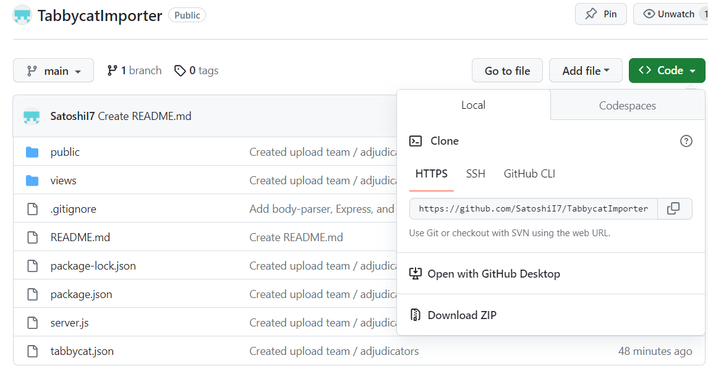
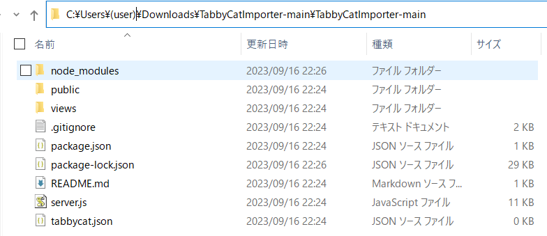

# TabbycatImporter
Tabby Cat Importer is a web application created using Node.js to upload debater / team / adjudicator data to [TabbycatDebate/tabbycat](https://github.com/TabbycatDebate/tabbycat).
## How to use
1. Install [Node.js](https://nodejs.org/en).
2. Install this repository from **Code >> Download ZIP**.

3. Expand the ZIP file. Copy the file path.

5. Open command prompt (cmd).
6. Enter
```
cd (file path)
npm install
node server.js
```
to start the local server.
8. Access [localhost:3000](http://localhost:3000/).
